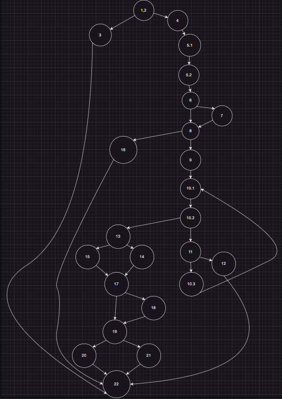
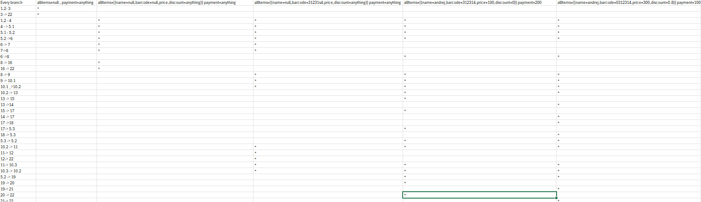

# Втора лабораториска вежба по Софтверско инженерство
# SI_2024_lab2_226030
# Андреј Дамјановски 226030

# Control Flow Graph

# Цикломатска комплексност
Цикломатската комплексност на овој код е 10, истата ја добив преку формулата P+1, каде што P е бројот на предикатни јазли. Во случајoв P=9, па цикломатската комплексност изнесува 10.

# Every Branch

Тест случаи според критериумот Every Branch

allitems=null , payment=anything : Се изминуваат 1,2->3, 3->22

allItems=[{name=null,barcode=null,price,discount=anything}] payment=anything :
Се изминуваат 1,2-> 4, 4->5.1, 5.1-> 5.2, 5.2-> 6, 6->7, 7->8, 8->16, 16->22

allItems=[{name=null,barcode=31231s4,price,discount=anything}] payment=anything
Се изминуваат 1,2-> 4, 4->5.1, 5.1-> 5.2, 5.2-> 6, 6->7, 7->8, 8->9 9->10.1, 10.1->10.2, 10.2->11,11->10.3, 10.3-> 10.2, 11->12, 12->22,

allItems=[{name=andrej,barcode=312314,price=100,discount=0}] payment=200:
1,2-> 4, 4->5.1, 5.1-> 5.2, 5.2-> 6, 6->8,8->9, 9->10.1, 10.1 -> 10.2, 10.2 -> 13, 13-> 15, 15-> 17, 17-> 5.3, 5.3-> 5.2, 10.3->10.2, 10.2-> 11, 11-> 10.3, 5.2->19, 19-> 20, 20-> 22

allItems=[{name=andrej,barcode=0312314,price=300,discount=0.8}] payment=100:

1,2-> 4, 4->5.1, 5.1-> 5.2, 5.2-> 6, 6->8,8->9, 9->10.1, 10.1 -> 10.2, 10.2 -> 13, 13-> 14, 14-> 17, 17-> 18, 18-> 5.3, 5.3-> 5.2, 10.2-> 11, 11-> 10.3, 10.3-> 10.2,  5.2-> 19, 19-> 21, 21-> 22

# Multiple Condition
if (item.getPrice() > 300 && item.getDiscount() > 0 && item.getBarcode().charAt(0)== '0')

# F && X && X 
item.getPrice()=200
# T && F && X 
item.getPrice()=350, item.discount=0
# T && T && F 
item.getPrice()=350, item.discount=0.5 item.barcode="123324"
# T && T && T 
item.getPrice()=350, item.discount=0.5 item.barcode="0123324"